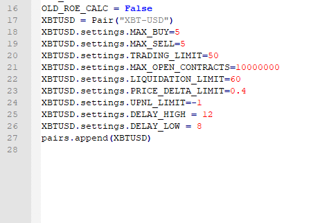
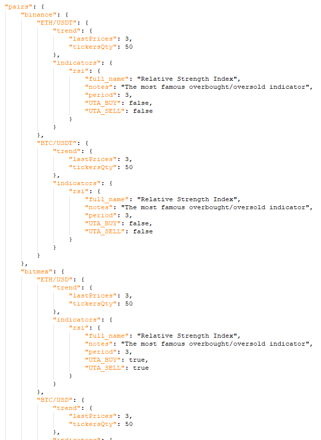
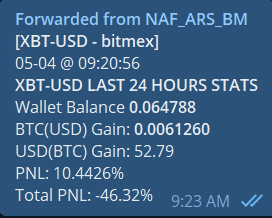
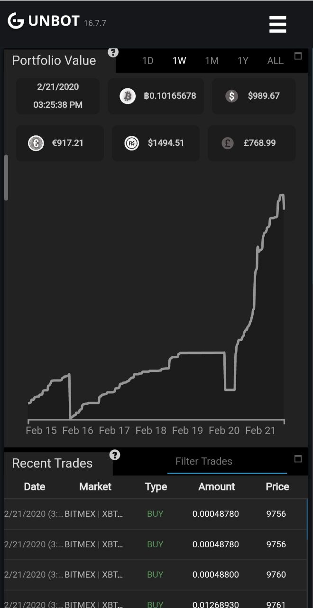
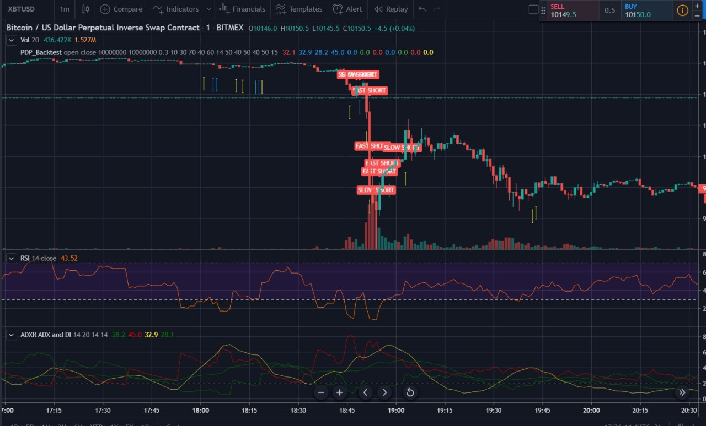

# Users Guide

####                                                        


## Disclaimer

_MarketMaker is really complicated and special. Many of us got liquidated \(lost all our balance at once\) on our way to understand mechanics of MarketMaker._

_We will not provide any support regarding Basic Setup of MarketMaker or Gunbot. With this Userguide you are able to start your ARS Addon for your existing GunBot with MarketMaker. It is presumed that you know MarketMaker and your Gunbot._

_It is presumed that you are already a valid license holder of gunbot with the Market Maker functions enabled as determined by your GUNTHY token balance. It is further assumed that you are already familiar with the workings of the market maker bot. As this program is being released as an executable, all required dependencies are included with the download._

## Abbreviations list

SRS - SR Switching 

PRG - Pre-Order Gap 

PDP - Pump/Dump Protection 

SPK - Small Position Killer 

IA - Ignore All 

GM - GRID Mode 

PR - Positive Roe Exception 

RL - Roe Limit Exception 

SP - Small Position Exception 

LSP - Liquidation Spread Protection 

WAP - Wallet Allocation Protection \(for isolated leverage\) 

UTAP - UTA Period Function 

DEMA - DCA by EMA 

PPP - Passive Position Protection 

TDS - Trade Direction Set 

ATL - Auto TL calculation 

ADP - Auto Disable Pair 

RBC - Rebates Buster Close 

SL - Stop Loss 

RPM - Report Manager 

PTL - Profits Trail Manager

## Historical Overview

This script was born from a necessity of having some sort of safety for the Gunbot MarketMaker add-on.  It has evolved over several revisions and now provides for much more than its original intent. The script pulls all of the data it needs from the gunbot jsons as required, and then writes changes to your gunbot config.js file.

The initial reason to create a script for Market Maker is to have some more control over position size so we don’t let it grow when close to liquidation price. There was a calculation of liquidation spread and a full stop buy/sells when the defined limit is reached. The liquidation spread is a delta % between the current price and the liquidation price. 

Then we got UTA coded into Gunbot. This indicators set allowed us to control the position enter, dca and position growing speed. 

UTA is following the initial Market Maker logic - to get profit from maker rebates, what this means is to keep position opened against the market and keep averaging it.

## Prerequisites

### Gunbot

It is presumed that you are already have a Gunbot License and have a fundamental knowledge on how to configure/operate it.

### Gunbot MM

It is presumed that you are already a valid license holder of gunbot with the Market Maker functions enabled as determined by your GUNTHY token balance \(you need have TOP 10 Rank in licensing system\). It is further assumed that you are already familiar with the workings of the market maker bot. As this program is being released as an executable, all required dependencies are included with the download.

## Installation

### Why we need Binance in API?

The ARS uses indicators data from 1 different time frames: 1 Minute and 1 Hour. The reason is we have different protection functions which have to use different time frames.

PDP \(Pump/Dump Protection\) uses indicators from 1 minute time frame to react fast, however Direction Indicator also called as PPP \(passive Position Protection\) uses large 1 Hour frame to see the market direction.

Gunbot cant use 2 different time frames for 1 exchange data, and this limitation could only be avioded by using second exchange \(in our case Binance Spot\) to read indicators for second time frame \(in our case it is 1 Hour, because 1 Minute indicators data have to be used from trading exchange for data to be correct\).

Gunbot cant use 2 different time frames for 1 exchange data, and this limitation could only be avoided by using second exchange \(in our case Binance Spot\) to read indicators for second time frame \(in our case it is 1 Hour, because 1 Minute indicators data have to be used from trading exchange for data to be correct\).

Thats the reason why we will need Binance Spot API key inside GB Config.

ARS Installer will configure it as a read only and never interrupt your real trades on binance.

ARS Installer will configure it as a read only and never interrupt your real trades on binance.

### ARS Installer

ARS Installer is an executable with user console interface. This installer fully sets up ARS and generates a USR\_VARs.ini file for the user and will launch Gunbot and then ARS by the end of the process.

It will help you to configure the first time setup or upgrade of ARS to the newest version.

**Automated - Windows Installation**

1. Download the latest version of ARS and extract it into a directory you plan to run ARS from, for example C:\ARS
2. Download the latest version of ars\_installer.exe and copy it to your ARS directory
3. Run ars\_installer.exe and type **N** for new Installation and press **enter** to start the installer process and walkthrough the below options.
4. After walking through the configuration below, you will be asked to run Gunbot and then ARS and then everything should be running successfully.

**ARS Installer Options**

The following options are available as part of the automated installer.

**Telegram Bot Token and ID Setup**

Enter your Telegram Bot Token; if you do not have one you can create one with BotFather.

Then enter your Telegram ID.

[Setup guide for Telegram Bot Token](https://wiki.gunthy.org/setup-and-general-settings/preferences/telegram-notifications)

**Exchange Settings**

Select your exchange to continue ARS and Gunbot for.

_ARS Supported Exchanges:_

1. Bitmex
2. KrakenFutures
3. BinanceFutures

**Select leverage according to risk level willing to accept**

_Exchanges Supported: BinanceFutures_

1. x20
2. x50
3. x125
4. Default Template to edit manually

**Enter path to Gunbot directory**

Enter the path the Gunbot directory is in

**Trading Exchange section - Master/Trading key / Secret**

Enter your master key and secret for your API key

Enter your trading key / secret

[Guide to configure API keys](https://wiki.gunthy.org/setup-and-general-settings/exchange-and-license-settings/connect-exchange/creating-api-keys)

**Binance section - Master/Trading key/secret**

\[Optional, but recommended\] For Gunbot Pro or higher license holders.

ARS uses Binance API keys to read indicators data, during the same time with your trading exchange.

Enter your master key / trading key

[Binance API key setup guide](https://wiki.gunthy.org/setup-and-general-settings/exchange-and-license-settings/connect-exchange/creating-api-keys#binance)

**Gunbot Configs Section - Gunthy Wallet**

Enter your Gunthy Wallet address

**GB Telegram Bot Token, ID, Admin ID, and Telegram Nick Setup**

Enter your Telegram Bot Token; if you do not have one you can create one with Bot father.

Then enter your Telegram ID

Then enter your Telegram Admin ID

Then enter your Telegram Nick.

[Setup guide for Telegram Bot Token](https://wiki.gunthy.org/setup-and-general-settings/preferences/telegram-notifications)

### Manual Installation

This program is released as an executable. You should have a complete copy of everything to run included in your download .zip file. Please extract the archive to its own folder.

Make sure that your Gunbot is NOT running and then we start.

**First Step:**

So you now have your Gunbot Folder and one Folder for ARS it should look like this for example:

/home/Gunbot

/home/Gunbot

/home/ARS

/home/ARS

Now open in your ARS folder you find a folder named config\_examples, inside this folder you see different exchanges\(ARS/config\_examples/Exchange/…\). Choose your exchange and copy the following files into your Gunbot folder and replace the existing ones:

- autoconfig.json

- config.js

- UTAconfig.json 

**Second Step:**

You might have noticed that inside the ARS/config\_exampes/Exchange folder is also another file called

- config.py

Please copy this file into the the ARS main directory \(/home/ARS/copy.py\).

For advanced users only: You can edit in config.py MAX\_BUY, MAX\_SELL, TRADING\_LIMIT and more \(This is an automated process so it is not recommended to change and interfere with it\).


**Third Step:**

In your main directory of ARS \(/home/ARS/\) you find a file named USR\_VARS\_example.ini, please rename it to USR\_VARS.ini.

Open that file and enter your Telegram Token, Chat ID and API Keys.


!!! We use BINANCE exchange as read only to get indicators for second time frame - this is essential thing we need for our PDP and PPP functions !!!

\(Info for MAC User/Linux user: rename the USR\_VARS.ini file to USR\_VARS \(without .ini\) and you are able to open and edit it\). After you have entered your details you need to rename it to USR\_VARS.ini !!!\)

Make sure you have 2 set of API Keys which you enter and 2 different Telegram Tokens. \(Do not wonder though if only one Telegram Bot is communicating with you. Right now we only use one Token since our GB Telegram Alerts are disabled and until yet not needed.\)

Now you see under Core section MM\_PATH, here you need to enter the path of your directory to find Gunbot\(MM\).

In our example it is /home/Gunbot

**Fourth Step:**

Start the update\_config.exe from ARS directory to update the template config files with your information you have entered in USR\_VARS.ini

Linux User: go to your ARS directory, in console you will need to give rights to your executable update\_configs,

 chmod +x update\_configs

./update\_configs

If the message “Successfully updated configs” appears everything is right, IF NOT something went wrong and you should start from the beginning and check your entered details in the USR\_VARS file.

Also it is presumed that you know how to setup and run pm2 for your Linux Server.

**Confirmation Step**

Start your gunbot as you normally do and wait to ensure that you are cycling properly. On the exchange you decided to use, orders should start to appear \(open orders and positions\) and your UTA should populate properly. 


IMPORTANT: ARS requires that gunbot is already running and building proper state.json files. If it is not working as expected, stop gunbot and check errors, review step by step the install guide.

IMPORTANT: ARS requires that gunbot is already running and building proper state.json files. If it is not doing so, please stop here and start again.

**Fifth Step:**

Start the mm\_anti\_rekt.exe executable file.

Linux users need to give rights for the executable again

 chmod +x mm\_anti\_rekt

 ./mm\_anti\_rekt

Confirm that you see ARS running in your console and you see the proper information being displayed for the pairs that you have configured.

Also confirm that your created Telegram Bot is communicating with you.

Your bot is now running.

**Sixth Step:**

If you use Binance Futures you might change your Leverage to something between x10 and x20 \(higher is not recommended\).

Also notice that Binance Futures uses USDT as Base and also TL minimum is set to 10.

Be aware that regarding your starting Balance your Trading Limit is automatically handled by ARS. Do not interfere with those settings.

**Addition:**

If you find ARS console cycling with error Parsing json state file error: 'prevpSar'

This error happens when you start new instance, because GB need some time to generate this prevpSar

Waiting will fix this issue by itself, if you don’t want to wait:

1. Stop GB

2. Open binance-USDT-BTC-state.json from jsons folder of GB

3. Search for pSar value

4. And add prevpSar just before it, this way

5. "prevpSar":"BUY","pSar" :"BUY"

Manual Installation Video




\*\*\*\*

### Adding Additional Pairs

Setting up additional pairs is fairly straightforward. ARS will check that pair’s state.json file in the same folder as before and will perform all the same safety functions. There are a few things that the user needs to do however:

1. Copy the pairs configuration block in the config.py file and then edit it for your pair.



Would then become something like this:


1. Copy the UTAconfig section and edit it to suit your coin pair.

So this would be edited


To look something like this:



1. Tune the pair settings in the config.py file by running the backtesting scripts on tradingview. Adjust on tradingview until you have settings that you are comfortable with ****
2. Change those settings in your config.py file to what you have decided on and restart the script.

 **See the section below to do this**

**Multi Pairs setup**

 Multi pair setup inside one ARS+GB instance is supported but not recommended because it would cause much more restarts or GB \(every time ARS changes settings in cofnig.js - Gunbot restart itself to reread the data\).

Recommended way is to use second ARS+GB setup for the second pair.

ARS uses few indicator which are calibrated and tested. If you will plan to use the non standard pairs \(not BTC\) - please follow the video guide to backtest and place correct data inside config.py:



### How to setup second instance of ARS to use Binance \(Spot\) stats from first one?

If you already using one ARS instance with binance read only pair inside to get indicators data and plan to install second GB+ARS instance for another exchange - you could configure the second instance to read the binance data from first one simple. Just change this option inside config.py:

> For windows: BIN\_PATH = r"C:\path\to\gunbot\directory\_of\_first\_instance"
>
> For Linux\MacOS: BIN\_PATH = "/path/to/gb/directory"

## Upgrades

The easiest way to upgrade is to run ARS Installer and choose Update\(U\) in console wizard.

To upgrade manually, follow the same procedure you performed to download your new copy of the program.

1. Shut down ARS and shut down your gunbot.

2. Make a backup copy in a safe place of the files referenced above in the initial installation:

a. Config.js

b. UTAconfig.json

c. USR\_VARS.ini

d. config.py

3. Unzip the archive into your gunbot folder.

4. Confirm that your configuration files have not been overwritten and/or make

any modifications required as per the current release notes for your upgrade.

Use your backups if files were overwritten by mistake.

5. Update GB config file by replacing it from /Config\_examples/ Folder

6. Start the update\_config.exe from ARS directory to update the template config

files with information you have in USR\_VARS.ini

7. Start your gunbot again. Then start ARS again.

## Concept and logic

ARS Became a multi mode add on which uses all GB MM functions and allow to switch the "Modes".

Modes are divided by profitability/risk factor from 1 to 5 and using different protection Functions.

All functions described under the modes Section.

### ARS Modes

Modes description will have a references to ARS Function which are described in a section later.

#### Mode 1 - MM logic - Risk Factor 1

This is tested and verified mode which gives 0.1-1% daily with low risk.

 All protection functions are active in this mode, MM Spread is not used.

Config example has no any additional options in this case.

```text
XBTUSD.settings.MAX_BUY=5
XBTUSD.settings.MAX_SELL=5
XBTUSD.settings.TRADING_LIMIT=50
XBTUSD.settings.MAX_OPEN_CONTRACTS=10000000
XBTUSD.settings.LIQUIDATION_LIMIT=60
XBTUSD.settings.PRICE_DELTA_LIMIT=0.4
XBTUSD.settings.DELAY_HIGH = 12
XBTUSD.settings.DELAY_LOW = 8
XBTUSD.settings.PDP_NO_ROE_CLOSE = True
XBTUSD.settings.TL_AC_PRICE = True
```

#### Mode 2 - Mixed MM-GRID Logic - Risk Factor 2

Mode when we use MM on Side moving market and GRID for directional trend flowing.

Inside GRID mode we only use LSP protection function. GRID\_SIDE is being selected using PPP Index.

Mode 2 changes the GRID states according to Market strength - the stronger market - the Higher:

* ROE
* GRID\_SPREAD
* TRADING LIMIT
* GRID\_MAX

Config Options to be added:

```text
USDTBTC.settings.TLX = 2
USDTBTC.settings.GRID = True
USDTBTC.settings.DCA_EMA = False
```

#### 

Mode 2 for GRID is fully customizable - see the full list of GRID variables below: 

| Option | Default Value | Description |
| :--- | :--- | :--- |
| GRID | FALSE | If enabled Only GRID - used mixed MM+GRID mode called "MODE 2", if Disabled - ARS uses old good MM only mode called "MODE 1\) |
| GRID\_RSI\_HIGH | 65 | GRID enter RSI values |
| GRID\_RSI\_LOW | 35 | GRID enter RSI values |
| GRID\_RSI\_HIGH\_EXIT | 65 | GRID exit RSI values |
| GRID\_RSI\_LOW\_EXIT | 35 | GRID exit RSI values |
| GRID\_MACD\_LOW | 30 | GRID macd triggers to detect the strength |
| GRID\_MACD\_MED | 60 | GRID macd triggers to detect the strength |
| GRID\_MACD\_HIGH | 150 | GRID macd triggers to detect the strength |
| GRID\_SPREAD\_CONFIRMED | 0.15 | Separate Variable per GRID Mode/Strength |
| GRID\_X\_MED | 1.5 | Separate Variable per GRID Mode/Strength |
| GRID\_X\_HIGH | 2.5 | Separate Variable per GRID Mode/Strength |
| GRID\_SPREAD\_NO\_CONFIRMED | 0.35 | Separate Variable per GRID Mode/Strength |
| GRID\_X\_LOW\_NC | 2 | Separate Variable per GRID Mode/Strength |
| GRID\_X\_MED\_NC | 2.5 | Separate Variable per GRID Mode/Strength |
| GRID\_X\_HIGH\_NC | 5 | Separate Variable per GRID Mode/Strength |
| ROE\_X\_WEAK | 1.25 | Separate Variable per GRID Mode/Strength |
| ROE\_X\_STRONG | 4 | Separate Variable per GRID Mode/Strength |
| ROE\_X\_NC | 2 | Separate Variable per GRID Mode/Strength |
| TL\_X\_WEAK | 5 | Separate Variable per GRID Mode/Strength |
| TL\_X\_AVERAGE | 7 | Separate Variable per GRID Mode/Strength |
| TL\_X\_STRONG | 9 | Separate Variable per GRID Mode/Strength |
| TL\_X\_NC\_SMALL | 2 | Separate Variable per GRID Mode/Strength |
| TL\_X\_NC\_BIG | 9 | Separate Variable per GRID Mode/Strength |

#### Mode 3 - Grid Only Mode - Risk Factor 2

GRID only mode without MM - used same GRID switching logic as mode 2.

GRID\_SIDE uses PPP Index.

Config options to be added:

```text
USDTBTC.settings.TLX = 2
USDTBTC.settings.GRID = True
USDTBTC.settings.DCA_EMA = False
USDTBTC.settings.GRID_FORCE = True
```

#### Mode 4 - GF Mode / x125 - Risk Factor 3

Single State GRID mode with very High TL. GRID\_SIDE changes re-actively by market condition to follow the market all the time. 

```text
USDTBTC.settings.TLX = 2
USDTBTC.settings.GRID = True
USDTBTC.settings.DCA_EMA = False
USDTBTC.settings.GRID_FORCE = True
USDTBTC.settings.GRID_FORCE_LOCK = True
```

Optionally this mode could be accompanied with option x125 which will enable MM same time with GRID \(on your own risk\) 

```text
USDTBTC.settings.TLX = 2
USDTBTC.settings.GRID = True
USDTBTC.settings.DCA_EMA = False
USDTBTC.settings.GRID_FORCE = True
USDTBTC.settings.GRID_FORCE_LOCK = True
USDTBTC.settings.x125 = True
```

OR use x125 mode without GF - in this case it will use GRID Switching logic of Mode 2 with MM same time and average TL. 

```text
USDTBTC.settings.TLX = 2
USDTBTC.settings.GRID = True
USDTBTC.settings.DCA_EMA = False
USDTBTC.settings.x125 = True
```

As it is more risky mode - LIQUDATION\_LIMIT option could also be decreased from default to allow risk more:

```text
USDTBTC.settings.LIQUDATION_LIMIT = 40
```

#### Full list of options for Mode 4:

| Option | Default Value | Description |
| :--- | :--- | :--- |
| GRID\_FORCE | FALSE | Enable GRID only trading with states Switching logic |
| GRID\_FORCE\_LOCK | FALSE | Force Always GRID with single state with large TL |

#### 

### Core Function Switch options

Each function could be disables by settings one of these variables inside Config.py:

| Block | Option | Default Value | Description |
| :--- | :--- | :--- | :--- |
| Core Function Switches | DCA\_EMA | TRUE | DCA by EMA blocker |
| Core Function Switches | SPK | TRUE | Small Position Killer ROE value - if below this ROE for Time below - closing at loss |
| Core Function Switches | PDP | TRUE | Pump / Dump Protection |
| Core Function Switches | PPP | TRUE | Passive Position Protection |
| Core Function Switches | pSar | TRUE | PPP Index calculation |
| Core Function Switches | TL\_AC | TRUE | Auto TL |
| Core Function Switches | AT\_DL | TRUE | ARS Trailing function |

### Core Default options

List of Core variables we use inside config.py with description:

| Option | Default Value | Description |
| :--- | :--- | :--- |
| BEAST\_SPREAD | 0.2 | Default MM\_SPREAD for Beast x125 Mode |
| MM\_SPREAD | 0 | Default MM\_SPREAD for MM |
| BIN\_NAME | "USDT-BTC" | Should be changed for non BTC pairs |
| BINANCE | TRUE | Use Binance to calculate PPP Index on 1 hour time frame. If disabled - using 1 minute time frame. |
| ROE | 8 | Default ROE value |
| ROE\_LIMIT | 2 | Default Limit value |
| PDP\_ROE | 20 | Increased ROE when we are inside Pump/Dump |
| PDP\_ROE\_LIMIT\_NRC | 50 | Increased values for function above |
| DELAY\_HIGH | 12 | Default GB delay |
| DELAY\_LOW | 8 | Delay use to trail position - when MAX BS disabled and extremely low Delay used to catch the spikes and close position with best ROE |
| MAX\_BUY | 0 | Default GB value |
| MAX\_SELL | 0 | Default GB value |
| TRADING\_LIMIT | 15 | Calculated automatically in ARS, however if TL\_AT set to False - this will be respected |
| UTA\_PERIOD | 1 | Default UTA period ARS start with when no position opened |
| MAX\_OPEN\_CONTRACTS | 10000000 | MOC for GB. High value used to never be triggered as ARS use own protection. Could be changed to user defined value. |
| REDUCING\_RATIO | 1 | RR for HR, Using 1 to close entire position if ARS protection triggered |
| UNLIMITED\_POSITION\_SIZE | 0.0001 | Safe position size when ARS ignores the protection. It recalculates inside ARS, but will respect user defined value if you set it. |

### LSP - Liquidation Spread Protection

This function is a calculation of the liquidation spread between the last price and your liquidation price. The setting for this will be found in your config.py file and will be further described in the Installation section. It is located in the “per pair” settings block.

An example setting of:

 **XBTUSD.settings.LIQUIDATION\_LIMIT=60**

… would mean that the function will engage when the spread between the last price and your liquidation price is 60% or less.

When engaged, this function will set max buy/max sell from current to 0/0 in your gunbot config.js if a specific amount of contracts is reached or if liquidation price distance is exceeded.

This stops BUY/SELL to prevent growing position when too close to liquidation:

BUYS/SELLS will be disabled until the position is ROE positive, then reducing trades are restored and it will be closed by ROE or SR.


| Option | Default Value | Description |
| :--- | :--- | :--- |
| LIQUIDATION\_STOP | 80 | Liq Limit value where DCA\_EMA changes EMA spread |
| LIQUIDATION\_LIMIT | 80 | Default Liquidation Limit. When reached - position freze |
| LIQUIDATION\_WAIT | 15 | Wait time between Slice of Limit |
| LIQUIDATION\_SLICE | 2 | Limit Slice size |

### Liquidation Limit Slicing

When Liq Spread &lt;99% - we slice it once in 15 minutes by step -2. So if you have set your liquidation limit at 60% for example, it will slowly over time slice the active liquidation stop timeout in increments of 2% until it reaches your configured limit of 60%. So it would move to 98%, then 30 minutes later it would go to 96%, then 15 minutes later it would go to 94%, etc. Stopping fully at 60% that you had configured. In this way, we do not use all of our available margin at one time, but rather we spread it out over time.

This helps to slow down the growth of our position when the market is against us.

This option is hardcoded, and no additional configuration setting is required.

### DEMA - DCA by EMA

This protection is to prevent any dollar cost averaging \(DCA\) from happening when the current price is close to the EMA, in the hopes of getting a better price later on while preserving your available margin for times when the effects of DCA would be better bang for your buck. 

So we choose the best points in which to send a DCA order, by using a really wide EMA spread which only allows buys/sells when price is outside the EMA range. This makes averaging less active and better.

### SPK - Small Position Killer

The small position killer will close out a position \(which size is &lt; TV  that is against the trend, **at a loss**, to enable a new position to be opened with the trend. This prevents us waiting ages and ages, for the trend to return to our favor. The picture below is an example of the **Small Position Killer** in action.


### 

| Option | Default Value | Description |
| :--- | :--- | :--- |
| SPK\_KILL | -100 | Small Position Killer ROE value - if below this ROE for Time below - closing at loss |
| SPK\_TIME | 15 | Time trigger for SPK function above |

### PDP - Pump/Dump protection

What it does is it recognizes a strong market move and _**closes the position at loss**_ if we are against the market move. Will not give more tech details now - it was tested and works.

We saw a few times where a position is opened just before pump or dump, and unlucky in the wrong direction that would have us stuck for ages. That's why this function was coded.

After all these I still saw how slowly the bleeding market could stay in deep negative roe for ages. That's the last stone we need to break.

And here are 3 options I see to fix this.

If we reached liq limit already \(like 50%\) and roe deep negative \(like &lt;-200\) and we know that we are against market now, we could do:

1. Close at loss
2. HODL for ages
3. Never get stuck in suck position

Best option is \#3 course. And few things were done to address this:

* The point \#1 was also implemented and it uses pSar. However with \#3 above we should never get to this point theoretically.
* Logic: If we detect market PUMP or DUMP
  * The trigger is:
    *  % between last candle close and current ask &gt;1% on 1 minute period and ADX &gt;40
    * And exit is ADX &lt;30 or Dis says that direction changed
    * When we are inside the pump/dump - we close position at loss if it is against market or just keep it open if it is by market
    * Then we set max buy sell to open only orders by trend side and enable Rebates Buster.
    * Rebates buster option ignores everything including UTA and even AVEP and just places limit orders. At the same time I disable SR to close only by ROE trailing
  * If the markets move against your position and SPK \(or whatever its called now\) kicks in, after your position is closed, rebates buster should then open up in the direction of the market
  * If position against trend – force close it with loss \(if loss is less than 2% of our wallet\)
  * And disable orders against market + enable Rebates Buster \(this crazy shit ignores everything including UTA and avgep and keep placing orders by trend side
  * If we already have position by trend – we just disable orders against trend and enable Rebates Buster.
  * Idea is to disable UTA \(because UTA opens position against market movement by MM nature, what is dangerous is when there is a Pump or Dump\) and Rebates Buster does this work.


| Option | Default Value | Description |
| :--- | :--- | :--- |
| PRICE\_DELTA\_LIMIT | 0.4 | Delta between last candle close and current ASK in 1 min frame. Used as one of PDP triggers. |
| PDP\_UPNL\_LIMIT | -1 | Allowed % loss of your wallet when PDP trying to close position against market move. If loss will be higher then this value - ARS will not close position |
| PDP\_SLOW\_LIMIT | -0.1 | Allowed % loss of your wallet when PDP trying to close position against SLOW \(predictive\) market move |
| PDP\_VOL\_FAST | 10000000 | Pair volume - one of additional confirming PDP Indicators |
| PDP\_VOL\_SLOW | 10000000 | Pair volume - one of additional confirming PDP Indicators for SLOW move |
| PDP\_TL\_FACTOR | 4 | TL Factor use when position follow the Pump/Dump |

| PDP\_NO\_ROE\_CLOSE | FALSE | Increases the ROE and Trailing to the values below to not to close the Position fast when we riding pump/dump |
| :--- | :--- | :--- |
| PDP\_ROE\_NRC | 200 | Increased values for function above |
| PDP\_ROE\_LIMIT\_NRC | 50 | Increased values for function above |

### WAP - Wallet Allocation Protection

Isolated Leverage used for exchanges without Cross-Leverage, like Kumex, KrakenFutures

We use “Wallet Pressure” calculation instead, which is how much of our wallet balance is used now in positions. If we reach defined values in % like 50% - we stop growing the position. This is an important protection when running multiple pairs.

In the case of ISOLATED LEVERAGE we don’t check LIQ LIMIT but check **wallet balance vs available margin**.

Option managed by ISL and ISL\_LIMIT Inside config.py file

### PPP - Passive Position Protection

Proactive protection to not be caught in HODL for ages.

It calculated complex PPP Index direction that used to decide:

* Open order direction
* Side Market
* Catch the market direction change to close at acceptable loss

PPP Index uses high time frame and will not change the direction fast or in advance. 

This is necessary for MM, because in DCA trading we need to keep average position and have a room for this. There should be a balance between closing at loss if index reactive and changes too fast and keep dca position or even hold it for some time.

| Option | Default Value | Description |
| :--- | :--- | :--- |
| PPP\_SIDE\_UPNL\_LIMIT | -0.5 | Allowed % loss of your wallet when PPP closes position at loss in case of market exit from Side and position againts PPP Index |
| PPP\_UPNL\_LIMIT | -1 | Allowed % loss of your wallet when PPP closes position at loss because PPP Index changes |
| PPP\_RB\_CLOSE | FALSE | If enabled - closing PPP by Enabling Rebates Buster \(read about RB in guide\) |
| PPP\_VOL | 6000 | Pair volume - one of additional confirming PPP indicator to allow ot not when position exit from Side and against Index |

### SideMarket Detection

ARS uses internal function to detect Side Moving market to correct the behavior accordingly:

On a side market we ignore almost all protection functions and only keep watching for Liquidation Spread.

### UTAP - UTA Periods tuner

UTA period is being changed to slow down the speed of DCA works only in Mode 1

### DCA Exceptions

SP -Small Position

An unlimited position in small in size and will have no blockers in action to enable full freedom \(unlimited\) of the gunbot Market Maker to buy and sell. No blockers are in action when position size is &lt; Trading Limit \* MAX buy/sell.

* Position size is less then max buy/sell \* TL \(small position\)

RL - Roe Limit

* roe &lt;0 and &gt;-20 \(except if liquidation spread is reached\)

PR -Positive ROE

* ROE &gt; 0

### SRS - SR Switching

Block of SR to Trailing switch.

Has a few scenarios and default is:

If current ROE &lt; ROE we set in config - keep SR enabled

If current ROE &gt;= ROE we set:

* Disable SR
* Set MAX Buy/Sell to 0
* Decrease exchange limit to extremely low
* Enable ROE Trailing
* Enable Market Close orders

All above allows to catch the price pikes and close at maximum profit.

For Kraken Futures where we don't have Market Close orders yet we use ROE trailing:

If Market is Side - we set SR Ration to 1.4

If market not side - we set SR Ratio to 1

This helps to eat the position slowly on the side market and swap it easily.

| Option | Default Value | Description |
| :--- | :--- | :--- |
| UNLIM\_ROE\_LOW | -20 | ROE period where we dont allow to DCA \(because no reason while price is close to 0\) |
| UNLIM\_ROE\_HIGH | -2 | ROE period where we dont allow to DCA \(because no reason while price is close to 0\) |

| SR\_TRAIL | FALSE | Use SR to trail position \(ROE close will not be used\) |
| :--- | :--- | :--- |
| SR\_SWITCH | TRUE | Enable and Disable SR |
| SR\_RATE\_CHANGE | FALSE | Sr rate changing to value below on side market and back to 1 if not side. Useful for KF |
| SR\_RATIO\_TRAIL | 1.4 | SR\_RATE on Side if enabled above |
| SR\_RATIO\_COMMON | 1 | SR\_RATE if enabled above |

### PRG - Pre Order Gap

Function allowing to use pre-order gap to replace the ST orders or Market orders or both.

| Option | Default Value | Description |
| :--- | :--- | :--- |
| PRE\_ORDER | FALSE | Use Pre Order Gap |
| PRE\_ORDER\_SR | FALSE | Use Pre Order Gap to ask like SR \(not replacing ROE close\) |
| ROE\_PRE\_ORDER\_SR | 0.5 | ROE below which we allo Pre Order to close positions |

### TDS - Trade Direction Set

Function the locks trades to only one direction according to the PPP index side.

### ATL - Auto TL calculation

Large function that calculated Trading Limit and changes the MAX BS to lower for a small wallets.

| Option | Default Value | Description |
| :--- | :--- | :--- |
| TL\_AC | TRUE | Enable of Disable Auto TL calculation. If Disabled - ARS will respect your TRADING\_LIMIT value |
| TL\_AC\_PRICE | FALSE | Use improved Auto TL formula which take BTC price into consideration |

| TLX | 1 | Atuto TL factor. Used with Mode 2 to increase Auto TL x times |
| :--- | :--- | :--- |


### ADP - Auto Disable Pair

Auto disables pair when position will be closed.

| Option | Default Value | Description |
| :--- | :--- | :--- |
| AUTO\_DISABLE | FALSE | Auto Disable pair when position closes |

### RBC - Rebates Buster Close

Experimental function which will close your position at loss using Rebates Buster.

In this case position will not be closed instantly by Market, but RB will keep placing BUY and SELL limit orders ignoring AVeP. 

It will take time but i=could return some loss as rebates or if price correct back during this process.

| Option | Default Value | Description |
| :--- | :--- | :--- |
| RB\_FORCE\_CLOSE | FALSE | One time function to close position at loss using RebatesBuster |

### SL - Stop Loss

Stop Loss will close your position at as soon as Unrealized PNL will became more then Stop Loss you set.

For Example : Stop Loss at 2% will close your position as soon as it will became cost you more then 2% of your wallet balance.

| Option | Default Value | Description |
| :--- | :--- | :--- |
| STOP\_LOSS | FALSE | Stop Loss Switch |
| SL\_LIMIT | 90 | Stop Loss limit \(how much % loss of your wallet it should close position at\) |

### RPM - Report Manager

Report Manager created a CSV file inside ARS directory with a name of your trading pair.

By default it will keep updating it every 24hours with stats and send TG message:



CSV File Structure:


| Option | Default Value | Description |
| :--- | :--- | :--- |
| STATS\_DTIME | 24 | RPM Time frame |

### PTL - Profits Trail Manager

Function that will trail daily gains and stop trading till the end of day if your PNL dropped below the Limit.

Example: Daily Target is 5% and we want to trail it by 2%, then logic will be:

If 5% gain reached - we look for additional 2% - if it back to 3% we stop trading for today

If 5+2 = 7 % reached we trail for next +2% - if it back to 5% we stop trading for today

| Option | Default Value | Description |
| :--- | :--- | :--- |
| PTRAIL | 5 | Daily Target |
| PLIMIT | 2 | Trail step |
| PTSTOP | FALSE | Enable Stop trading if PNL reached/lost |

### SLR - Short/Long ROE

Allows to set separate values for Short Position and Long position.

Because on bitmex/kraken Longs are more expensive then Short.

| Option | Default Value | Description |
| :--- | :--- | :--- |
| ROE\_DELIM | FALSE | Switch |
| ROE\_S | 0 | ROE for Short positions |
| ROE\_L | 0 | ROE for Long positions |

## Additional Functions of ARS

There is a bunch of additional functions realized inside ARS:

| Option | Default Value | Description |
| :--- | :--- | :--- |
| DCA\_FORCE | FALSE | Force DCA ignoring everything but LIQUIDATION LIMIT |
| UTA\_SKIP | FALSE | ignore UTA |
| NO\_MARKET\_ORDERS | FALSE | Dont close at market when we trail position |
| NO\_STUCK | FALSE | Ignored next values if enabled and just closed at any loss when triggered: PDP\_UPNL\_LIMIT  PDP\_SLOW\_LIMIT  PPP\_SIDE\_UPNL\_LIMIT  PPP\_UPNL\_LIMIT |
| TT\_LOCK | 0.5 | Effective only on BinanceFutures - Dont allow to post LONG orders when position is SHORT and vice versa if ROE between 0 and this TT\_LOCK |
| ISL\_LIQ\_IGNORE | 5 | Ignore the Liquidation Spread until this wallet allocation % reached. Effective on KrakenFutures, never use it on bitmex and only with low leverage on binance Futures. To disable set 0 |
| x125 | FALSE | Dont effective alone. If set with GRID will enabled Gunthars Beast mode \(using MM and GRID same time with leverage 125\) |
| NO\_SIDE\_LOCK | FALSE | Dont block position on side market when Unrealized PNL is 0.5% \(by default it does to be able to close with small loss if we exit side market against PPP index\) |
| TRADE\_SIDE\_LOCK | "None" | You could force lock ARS to only once side trading 4ever \(always LONG or always SHORT\) |

## Console Output

Console output contains a set of useful information from every active Function of ARS


**PPP Index state reading from local file to keep it same if ARS restarts:**

PPP Index state in file: BUY

**Auto Calculate TL:**

ATL - BTC Price is: 9026.5

ATL - New TL to set is: 32

**Report Manager checking CSV file and print live data:**

RPM - Stats File exist

PRM - LAST 24 HOURS STATS: Wallet Balance 0.067872, BTC\(USD\) Gain: -0.0040330, USD\(BTC\) Gain: -36.4, PNL: -5.9418%, Total PNL: -47.11%

**Profit Trailing Manager stats for Today:**

PTM - New Trailing Target: 2 \| Current PNL: -5.941772748703445

**Position Size Limits calculations:**

PSize Limits - PStop: 1728.7336163999998, PLow: 432.18340409999996, PMed: 576.2445388, PHigh: 864.3668081999999

**Position Size which allowed to be killed by SPK:**

SPK - Small Pos Size is: 200

**Side/noSide Market status:**

SideMarket is: False

IA - state is: True

**SR Switch - No trailing the position now:**

SRS - No Trailing

**Liquidation spread is safe now:**

LSP - SPREAD outside Limit - Setting MB 0, MS 1

SRS - SR Ratio: 1

**IA active block:**

IA - non Side - Trend Folowing Function

IA - pSar SELL \| prevpSar SELL \| Close Signal False

IA - MB: 0, MS: 1

UTA State: False  


**Current live stats of most important indicators and config:**

\[XBT-USD\] Balance: 0.0638392 \(0.0611\) @ 9026.5 \| Current: -1859.0 \(-13.08%\) @ 9014.694 \| Liq: 12.95K / LS: 30.28% / LL: 14% / PPP Index: BUY / UPNL: -0.46% \(-0.0003\) / EMA: 0% / Pdt: -0.03 / ADX: 29.78 / RB: False / Flip: False / Alloc: 4 / SideMarket: False // MBuy: 0 / MSell 1 / MOC: 1.00G / UTAP: 1 / SRL S&L 0&0 / TL: 144 / CCATL: 32 / Delay: 10 / UTA: False / GRID: False / x125 mode: False / MM Spread: 0 / ROE CLOSE: 11.25 / GB v19.1.1 / ARS v6.82  
****

### Telegram Alerts

All TG messages from ARS are marked with function abbreviation and could be checked with this functions guide. Below are just some examples:

**Every 15 minutes you will see a status message with most important stats:**

 IA MODE ENABLED 05-05 @ 11:00:18 ARS v6.82 GB v19.1.1 Trading Pair: bitmex - XBT-USD

Balances data: Total: 0.06389883 \(0.0591\) USD\(BTC\) Cost: 577.0064

Current state: Position size: -4019.0 Current Price: 9030.0 AvEP: 9026.9002 Liquidation Spread: 13.84% Limit 14 Liquidation Price: 10481 ROE: -3.4328%

Verbose Stats: Unrealized PNL: 0.31% \(0.0002\) EMA: 0% / PdT: 0.0% ADX: 34.9 / RB: False Flipped: False Wallet Allocation 7% Side Market: False

Config options set: MB: 0 / MS: 0 TL: 144 / Auto TL: 8 MOC: 1.00G / PPP Index: BUY UTA: 1 / SRL S/L: 1/1 MM SPREAD: 0.04 Bot Delay: 10 / UTA: True ROE CLOSE 11.25

**ROE trailing message:**

\[XBT-USD - bitmex\] SRS - Trailing now - Delay 8, ROE 9.0126%

**Position Close message:**

 \[XBT-USD - bitmex\] 05-05 @ 14:31:03 XBT-USD POSITION CLOSED Position Size 129.0 Last known ROE value: 10.1391% Current price: 8893.0 Close Gain: 0.03530216% BTC\(USD\) Gain: 0.000005 USD\(BTC\) Gain: 0 Wallet Balance: 0.05847128

\[XBT-USD - bitmex\] No position opened changing values back to defined


## Tuning and Backtesting

There are 2 TradigView script available to backtest the PPP and PDP function variables.

Actually script MUST be used if you plan to use non standard \(not BTC/XBT\) pairs.

Backtesting video guide:




### PPP Function




The functions works this way:

Is Signal is Sell - we lock trades to only Sell, if Buy we lock trades to only buy

BUT if RSI between 40 and 60 - we are inside Side market and enable 2 way trading

When signal changes from Buy to Sell and vise versa - we sell at loss \(1% default\)

Script should be used for 1H time frame.

Pine uses RSI and MACD to detect signals

Converting to Python code it looks like:

If prerpSar != pSar and \_macd &gt; 0 and rsi6 &gt; 71: ARS\_pSar = "BUY"

elif prerpSar != pSar and \_macd &lt; 0 and rsi6 &lt; 29: ARS\_pSar = "SELL"

elif \_macd &gt; 0 and rsi6 &gt; 71 and ARS\_pSar == "SELL": ARS\_pSar = "BUY"

elif \_macd &lt; 0 and rsi6 &lt; 29 and ARS\_pSar == "BUY": ARS\_pSar = "SELL"


**PPP in action:**



### PDP Function





PDP backtest is a bit laggy because I cant fight with Pine scripts anymore...

It shows sometime both BUY and SELL on same candle but this is a TV fckery I cant fix yet.

You could see - SLOW signals are signalling in most cases in advance

Yellow arrow from below is a SLOW Pump DUmp close signals

Blue ones is FAST close signals

Use it with 1Minute time frame and XBTUSD Bitmex pair

Logic is complicated

LONG = DIPlus &gt; DIMinus

SHORT = DIMinus &gt; DIPlus

RSI\_OUT\_FAST = calc\_rsi &gt; rsi\_hf or calc\_rsi &lt; rsi\_lf

RSI\_OUT\_SLOW = calc\_rsi &gt; rsi\_hc or calc\_rsi &lt; rsi\_lc

RSI\_IN\_FAST = calc\_rsi &gt; rsi\_lf and calc\_rsi &lt; rsi\_hf

RSI\_IN\_SLOW = calc\_rsi &gt; rsi\_lc and calc\_rsi &lt; rsi\_hc

FAST\_LONG = LONG and vol &gt; vollim and pdT &gt; pdT\_lim and ADX &gt; adx\_fo and RSI\_OUT\_FAST

FAST\_SHORT = SHORT and vol &gt; vollim and pdT &gt; pdT\_lim and ADX &gt; adx\_fo and RSI\_OUT\_FAST

FAST\_CLOSE= RSI\_IN\_FAST or abs\(DIPlus-DIMinus\) &lt; DI\_spr or ADX &lt; adx\_fc

SLOW\_LONG= LONG and vol &gt; vollimh and DIPlus &gt; DI\_lim and ADX &gt; adx\_so and RSI\_OUT\_SLOW and DIPlus\[1\] &gt; DI\_lim and DIPlus\[2\] &gt; DI\_lim and calc\_rsi\[1\] &gt; rsi\_hc and calc\_rsi\[2\] &gt; rsi\_hc

SLOW\_SHORT= SHORT and vol &gt; vollimh and RSI\_OUT\_SLOW and DIMinus &gt; DI\_lim and ADX &gt; adx\_so and DIMinus\[1\] &gt; DI\_lim and DIMinus\[2\] &gt; DI\_lim and calc\_rsi\[1\] &lt; rsi\_lc and calc\_rsi\[2\] &lt; rsi\_lc

SLOW\_CLOSE= RSI\_IN\_SLOW or abs\(DIPlus-DIMinus\) &lt; DI\_spr or ADX &lt; adx\_sc

There are ADX + RSI + Volume indicators


## Settings List

All ARS settings are hardcoded with defaults values.

However each and every could be overwritten by adding this variable to config.py with prefix:

_PAIRNAME_.settings._VARIABLE_ = _VALUE_

Example: XBTUSD.settings.MAX\_BUY = 1

Full list of default settings in a table below:

| Block | Option | Default Value | Description |
| :--- | :--- | :--- | :--- |
| Core Settings | MAX\_BUY | 0 | Default GB value |
| Core Settings | MAX\_SELL | 0 | Default GB value |
| Core Settings | TRADING\_LIMIT | 15 | Calculated automatically in ARS, however if TL\_AT set to False - this will be respected |
| Core Settings | UTA\_PERIOD | 1 | Default UTA period ARS start with when no position opened |
| Core Settings | MAX\_OPEN\_CONTRACTS | 10000000 | MOC for GB. High value used to never be triggered as ARS use own protection. Could be changed to user defined value. |
| Core Settings | REDUCING\_RATIO | 1 | RR for HR, Using 1 to close entire position if ARS protection triggered |
| Core Settings | UNLIMITED\_POSITION\_SIZE | 0.0001 | Safe position size when ARS ignores the protection. It recalculates inside ARS, but will respect user defined value if you set it. |
| Core Settings | LIQUIDATION\_STOP | 80 | Liq Limit value where DCA\_EMA changes EMA spread |
| Core Settings | LIQUIDATION\_LIMIT | 80 | Default Liquidation Limit. When reached - position freze |
| Core Settings | LIQUIDATION\_WAIT | 15 | Wait time between Slice of Limit |
| Core Settings | LIQUIDATION\_SLICE | 2 | Limit Slice size |
| PDP - Pump / Dump Protection | PRICE\_DELTA\_LIMIT | 0.4 | Delta between last candle close and current ASK in 1 min frame. Used as one of PDP triggers. |
| PDP - Pump / Dump Protection | PDP\_UPNL\_LIMIT | -1 | Allowed % loss of your wallet when PDP trying to close position against market move. If loss will be higher then this value - ARS will not close position |
| PDP - Pump / Dump Protection | PDP\_SLOW\_LIMIT | -0.1 | Allowed % loss of your wallet when PDP trying to close position against SLOW \(predictive\) market move |
| PDP - Pump / Dump Protection | PDP\_VOL\_FAST | 10000000 | Pair volume - one of additional confirming PDP Indicators |
| PDP - Pump / Dump Protection | PDP\_VOL\_SLOW | 10000000 | Pair volume - one of additional confirming PDP Indicators for SLOW move |
| PDP - Pump / Dump Protection | PDP\_TL\_FACTOR | 4 | TL Factor use when position follow the Pump/Dump |
| PPP - Passive Position Protection | PPP\_SIDE\_UPNL\_LIMIT | -0.5 | Allowed % loss of your wallet when PPP closes position at loss in case of market exit from Side and position against PPP Index |
| PPP - Passive Position Protection | PPP\_UPNL\_LIMIT | -1 | Allowed % loss of your wallet when PPP closes position at loss because PPP Index changes |
| PPP - Passive Position Protection | PPP\_RB\_CLOSE | FALSE | If enabled - closing PPP by Enabling Rebates Buster \(read about RB in guide\) |
| PPP - Passive Position Protection | PPP\_VOL | 6000 | Pair volume - one of additional confirming PPP indicator to allow ot not when position exit from Side and against Index |
| GRID settings | GRID\_RSI\_HIGH | 65 | GRID enter RSI values |
| GRID settings | GRID\_RSI\_LOW | 35 | GRID enter RSI values |
| GRID settings | GRID\_RSI\_HIGH\_EXIT | 65 | GRID exit RSI values |
| GRID settings | GRID\_RSI\_LOW\_EXIT | 35 | GRID exit RSI values |
| GRID settings | GRID\_MACD\_LOW | 30 | GRID macd triggers to detect the strength |
| GRID settings | GRID\_MACD\_MED | 60 | GRID macd triggers to detect the strength |
| GRID settings | GRID\_MACD\_HIGH | 150 | GRID macd triggers to detect the strength |
| GRID settings | GRID\_SPREAD\_CONFIRMED | 0.15 | Separate Variable per GRID Mode/Strength |
| GRID settings | GRID\_X\_MED | 1.5 | Separate Variable per GRID Mode/Strength |
| GRID settings | GRID\_X\_HIGH | 2.5 | Separate Variable per GRID Mode/Strength |
| GRID settings | GRID\_SPREAD\_NO\_CONFIRMED | 0.35 | Separate Variable per GRID Mode/Strength |
| GRID settings | GRID\_X\_LOW\_NC | 2 | Separate Variable per GRID Mode/Strength |
| GRID settings | GRID\_X\_MED\_NC | 2.5 | Separate Variable per GRID Mode/Strength |
| GRID settings | GRID\_X\_HIGH\_NC | 5 | Separate Variable per GRID Mode/Strength |
| GRID settings | ROE\_X\_WEAK | 1.25 | Separate Variable per GRID Mode/Strength |
| GRID settings | ROE\_X\_STRONG | 4 | Separate Variable per GRID Mode/Strength |
| GRID settings | ROE\_X\_NC | 2 | Separate Variable per GRID Mode/Strength |
| GRID settings | TL\_X\_WEAK | 5 | Separate Variable per GRID Mode/Strength |
| GRID settings | TL\_X\_AVERAGE | 7 | Separate Variable per GRID Mode/Strength |
| GRID settings | TL\_X\_STRONG | 9 | Separate Variable per GRID Mode/Strength |
| GRID settings | TL\_X\_NC\_SMALL | 2 | Separate Variable per GRID Mode/Strength |
| GRID settings | TL\_X\_NC\_BIG | 9 | Separate Variable per GRID Mode/Strength |
| GF - GRID Force | GRID\_FORCE | FALSE | Enable GRID only trading with states Switching logic |
| GF - GRID Force | GRID\_FORCE\_LOCK | FALSE | Force Always GRID with single state with large TL |
| Delay Values | DELAY\_HIGH | 12 | Default GB delay |
| Delay Values | DELAY\_LOW | 8 | Delay use to trail position - when MAX BS disabled and extremely low Delay used to catch the spikes and close position with best ROE |
| TL Factor | TLX | 1 | Auto TL factor. Used with Mode 2 to increase Auto TL x times |
| SPK - Small Position Killer | SPK\_KILL | -100 | Small Position Killer ROE value - if below this ROE for Time below - closing at loss |
| SPK - Small Position Killer | SPK\_TIME | 15 | Time trigger for SPK function above |
| ROE values | ROE | 8 | Default ROE value |
| ROE values | ROE\_LIMIT | 2 | Default Limit value |
| ROE values | PDP\_ROE | 20 | Increased ROE when we are inside Pump/Dump |
| ROE values | PDP\_ROE\_LIMIT | 5 | Increased ROE Limit when we are inside Pump/Dump |
| Unlimites position | UNLIM\_ROE\_LOW | -20 | ROE period where we dont allow to DCA \(because no reason while price is close to 0\) |
| Unlimites position | UNLIM\_ROE\_HIGH | -2 | ROE period where we dont allow to DCA \(because no reason while price is close to 0\) |
| Core Function Switches | DCA\_EMA | TRUE | DCA by EMA blocker |
| Core Function Switches | SPK | TRUE | Small Position Killer ROE value - if below this ROE for Time below - closing at loss |
| Core Function Switches | PDP | TRUE | Pump / Dump Protection |
| Core Function Switches | PPP | TRUE | Passive Position Protection |
| Core Function Switches | pSar | TRUE | PPP Index calculation |
| Core Function Switches | TL\_AC | TRUE | Auto TL |
| Core Function Switches | AT\_DL | TRUE | ARS Trailing function |
| BINANCE Indicators | BIN\_NAME | "USDT-BTC" | Should be changed for non BTC pairs |
| BINANCE Indicators | BINANCE | TRUE | Use Binance to calculate PPP Index on 1 hour time frame. If disabled - using 1 mknute time frame. |
| Additional non core functions | AUTO\_DISABLE | FALSE | Auto Disable pair when position closes |
| Additional non core functions | DCA\_FORCE | FALSE | Force DCA ignoring everything but LIQUIDATION LIMIT |
| Additional non core functions | PRE\_ORDER | FALSE | Use Pre-Order Gap |
| Additional non core functions | PRE\_ORDER\_SR | FALSE | Use Pre-Order Gap to ask like SR \(not replacing ROE close\) |
| Additional non core functions | ROE\_PRE\_ORDER\_SR | 0.5 | ROE below which we allow Pre-Order to close positions |
| Additional non core functions | SR\_TRAIL | FALSE | Use SR to trail position \(ROE close will not be used\) |
| Additional non core functions | SR\_SWITCH | TRUE | Enable and Disable SR |
| Additional non core functions | SR\_RATE\_CHANGE | FALSE | Sr rate changing to value below on side market and back to 1 if not side. Useful for KF |
| Additional non core functions | SR\_RATIO\_TRAIL | 1.4 | SR\_RATE on Side if enabled above |
| Additional non core functions | SR\_RATIO\_COMMON | 1 | SR\_RATE if enabled above |
| Additional non core functions | UTA\_SKIP | FALSE | ignore UTA |
| Additional non core functions | TL\_AC\_PRICE | FALSE | Use improved Auto TL formula which take BTC price into consideration |
| Additional non core functions | PDP\_NO\_ROE\_CLOSE | FALSE | Increases the ROE and Trailing to the values below to not to close the Position fast when we riding pump/dump |
| Additional non core functions | PDP\_ROE\_NRC | 200 | Increased values for function above |
| Additional non core functions | PDP\_ROE\_LIMIT\_NRC | 50 | Increased values for function above |
| Additional non core functions | NO\_MARKET\_ORDERS | FALSE | Dont close at market when we trail position |
| Additional non core functions | RB\_FORCE\_CLOSE | FALSE | One time function to close position at loss using RebatesBuster |
| Additional non core functions | NO\_STUCK | FALSE | Ignored next values if enabled and just closed at any loss when triggered: PDP\_UPNL\_LIMIT  PDP\_SLOW\_LIMIT  PPP\_SIDE\_UPNL\_LIMIT  PPP\_UPNL\_LIMIT |
| Additional non core functions | TT\_LOCK | 0.5 | Effective only on BinanceFutures - Dont allow to post LONG orders when position is SHORT and vice versa if ROE between 0 and this TT\_LOCK |
| Additional non core functions | ISL\_LIQ\_IGNORE | 5 | Ignore the Liquidation Spread until this wallet allocation % reached. Effective on KrakenFutures, never use it on bitmex and only with low leverage on binance Futures. To disable set 0 |
| Additional non core functions | GRID | FALSE | If enabled Only GRID - used mixed MM+GRID mode, if Disabled - ARS uses old good MM only mode called "MODE 1\) |
| Additional non core functions | x125 | FALSE | Dont effective alone. If set with GRID will enabled Gunthars Beast mode \(using MM and GRID same time with leverage 125\),called "MODE 3" |
| Additional non core functions | NO\_SIDE\_LOCK | FALSE | Dont block position on side market when Unrealized PNL is 0.5% \(by default it does to be able to close with small loss if we exit side market against PPP index\) |
| Additional non core functions | TRADE\_SIDE\_LOCK | "None" | You could force lock ARS to only once side trading 4ever \(always LONG or always SHORT\) |
| Additional non core functions | STATS\_DTIME | 24 | RPM Time frame |
| Additional non core functions | BEAST\_SPREAD | 0.2 | Default MM\_SPREAD for Beast x125 Mode |
| Additional non core functions | MM\_SPREAD | 0 | Default MM\_SPREAD for MM |
| SL - Stop Loss | STOP\_LOSS | FALSE | Stop Loss Switch |
| SL - Stop Loss | SL\_LIMIT | 90 | Stop Loss limit \(how much % loss of your wallet it should close position at\) |
| PTM - Profit Trailing Manager | PTRAIL | 5 | Daily Target |
| PTM - Profit Trailing Manager | PLIMIT | 2 | Trail step |
| PTM - Profit Trailing Manager | PTSTOP | FALSE | Enable Stop trading if PNL reached/lost |
| SLR - Short/Long ROE separation | ROE\_DELIM | FALSE | Switch |
| SLR - Short/Long ROE separation | ROE\_S | 0 | ROE for Short positions |
| SLR - Short/Long ROE separation | ROE\_L | 0 | ROE for Long positions |
|  |  |  |  |

## Troubleshooting

Common startup issues are described here. This list will be updated as community members forward their issues and fixes to me.

* Announcements channel with Last ARS builds: [https://t.me/joinchat/AAAAAFYTloV9ioR0VrrPng](https://t.me/joinchat/AAAAAFYTloV9ioR0VrrPng)

## Files Structure

Mm\_anti\_rekt.exe - main ARS executable

ars\_installer.exe - first start config and update executable

USR\_VARS.ini - INI file with user data

Config.py - Config file with ARS specific configs

Config template files to be replaced in GB BOT folder with every build:

/Config\_Examples/config.js

/Config\_Examples/UTAconfig.json

/Config\_Examples/autoconfig.json

## 

