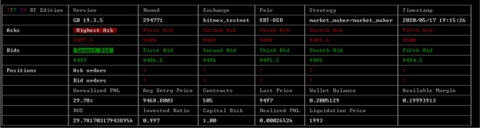
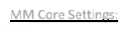
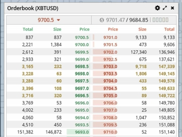
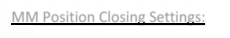
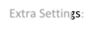
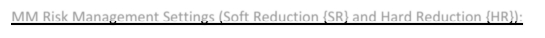
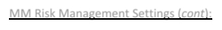
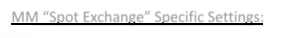
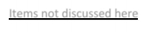

# GB MM Introduction

Market Maker

\(written on build v19.4.4\)

Welcome to the GUNTHY Market Maker Bot. If you have got this far to accessing the bot, then you have a brief idea of what it is supposed to do.

This is just a guide on the some basic MM information to get people started.

Grid Layout:

The MM grid shows you information about your open position and margin position

_screenshot: 1.1_

The most important information to pay attention to:

- **Avg Entry Price** _\(AvgEP\)_: This is reported by the exchange and shows what the average entry price is if your current open position. This is important as a lot of MM’s actions are based around this.

- **Contracts**: This shows the total of your open position.

- **Last Price**: Last price that a contract was traded at the exchange.

- **Wallet Balance**: How much equity you have.

- **Available Margin**: This is reported and calculated by the exchange. Available Margin is a combination of your wallet balance, open contracts and unrealised profit and loss.

- **ROE%** and **Unrealised PNL%:** Shows the current positions profit status if the position was to be closed.

- **Invested Ratio**: Numerical display between 0 and 1. This shows the ratio between your “Wallet Balance” and “Available Margin”.

- **Capital Risk**: Numerical display between 0 and 1. This shows the ratio between your “Wallet Balance” and your "INITIAL\_CAPITAL" setting.

- **Liquidation Price**: Reported by the exchange, this is the price where your current open position gets closed completed for a loss by the Exchange.

\*\*WARNING\*\*: DO YOUR RESEARCH CAREFULLY. When using fixed leverage, only your open position gets liquidated. If your using cross leverage, then your whole account is used as collateral and your account will be closed if liquidation is triggered. Both methods have their pro’s and con’s. Liquidation results vary from Exchange to Exchange

MM Core Settings:

**"BUY\_METHOD"**: "Market\_Maker"

**"SELL\_METHOD"**: "Market\_Maker"

**"INITIAL\_CAPITAL"**: 0.01 – Set this to your wallet balance the first time you enable MM. You may need to adjust this setting if you conduct deposits or withdrawls. Also, as your wallet balance grows, this setting will be updated accordingly. _\(affects settings, CAPITAL\_RISK\)._

**"TRADING\_LIMIT"**: 30 – Set this to how many contracts you want trade each trade.

**"MAX\_BUY"**: 5 – Numerical. How many trades are to be sent at BID _\(see screenshot 1.2\)_. When in LONG position, MM will send 5 DCA orders at BID. When in a SHORT position, MM will send 5 profit orders at BID. Profit orders won’t get placed below AvgEP.

**"MAX\_SELL"**: 5 – Numerical. How many trades are to be sent at ASK _\(see screenshort 1.2\)_. When in SHORT position, MM will send 5 DCA orders at ASK. When in LONG position, MM will send 5 profit orders at BID. Profit orders won’t get placed above AvgEP.

_screenshot: 1.2_

_\(screenshot: With Max\_Buy: 5 and Max\_Sell: 5, five buy orders AND five sell orders are sent to the exchange._ WARNING: _The amount for each order sent is set by TRADING\_LIMIT. Chose your TL + MBS wisely\)_

**"CANCEL\_SPREAD"**: 0.05 – Set as a percent. This setting manages when all orders are cancelled when BID/ASK or AvgEP slides too much away from orders placed. Orders will get cancelled and replaced in accordance with your strategy settings \(TIP: Set this higher than TRADING\_FEES and FIRST\_ORDER\_SPREAD\)

**"FIRST\_ORDER\_SPREAD"**: 0.02 – Set as a percentage. This setting manages the spread between BID and ASK orders when you’re are in NO POSITION _\(see screenshot 1.2 for example\)_. This setting has no affect when you have an open position.

**“FLIP”**: true – _\(see also TRADING\_FEES\)_ This setting is unique. Set to false to prevent MAX\_BUY or MAX\_SELL from sending profit orders.

MM Position Closing Settings:

**“ROE”**: 30 – Set as a percent. Standard setting to govern when MM will close an entire position for profit.

**"ROE\_TRAILING"**: False – Set true if you want to enable trailing for ROE

**"ROE\_LIMIT"**: 0.5 – Sets trigger thresholds for trailing \(ie: “ROE + 0.5%“ and “ROE – 0.5%”\).

Extra Settings:

**"PRE\_ORDER"**: false – Force ROE close trades to be sent as “post only” as maker trade to qualify for fee rebates \(or low trading\_fees\) depending on the exchange. ROE orders that get matched instantly as taker trades will get rejected by the exchange

**"PRE\_ORDER\_GAP"**: -0.03. Set as a percent. \(Requirement: PRE\_ORDER: true\) This will adjust the posting price for ROE close order so the order gets sent deeper into the books. \(TIP: Helpful if you find ROE close orders get rejected too often\)

_“MAKER\_FEES”: false – \(placeholder\). Still seen in configs, this setting was used to send orders as “post only” to qualify for fee rebates._

**"MARKET\_CLOSE"**: false – Set this to true if you want ROE close orders to be sent at market. Increases chances of order being filled HOWEVER taker fees are paid and fill price is NOT guaranteed.

**“TRADING\_FEES”**: 0.075 – \(NOTE: setting is found in EXCHANGE setting of the config\). Affects MAX\_BUY and MAX\_SELL profit closing trades. Set TRADING\_FEES to increase spread between AvgEP and first profit order to cover exchange fees _\(requires FLIP enabled\)_.

MM Risk Management Settings \(Soft Reduction {SR} and Hard Reduction {HR}\):

**"SR\_INVESTED\_PERC"**: 0.75 – When calculated “Invested Ratio” is below SRIP, consider position as high risk. As soon as position is profitable, MM will close portion of position at any profit to reduce risk _\(requires: REDUCING\_RATIO\)._ Set 0.1 to disable.

**"SR\_RATIO"**: 1 – Determine how much you position will be reduced. This is divisional on Open Contracts. If you have 5000 contracts open and SR\_RATIO: 2, an order will be sent for 2500 contracts, closing half of your position \(5000/2 = 2500\)

**"SR\_LIMIT\_LONG"**: 1 – _\(default 1\)_ When LONG, apply cap on how many times SR will trigger

**"SR\_LIMIT\_SHORT"**: 1 - _\(default 1\)_ When SHORT, apply cap on how many times SR will trigger

**"SR\_SPREAD"**: 0.05 – set as a percent. Force a minimum spread between AvgEP and posting price of SR. This is to help cover fees on exchanges like Binance.\

MM Risk Management Settings \(cont \):

**"MM\_SPREAD"**: 0.02 – set as percentage. This setting controls the minimum spread between AvgEP and posting price for Max\_Buy and Max\_Sell DCA orders

**"CAPITAL\_RISK"**: 0.1 – _\(dependant setting REDUCING\_RATIO\)_. When “Capital Risk” in grid is lower than this setting, trigger HR selling a part of your position for loss _\(set 0.1 to disable\)_. CR trades are sent at market. Position is reduced in accordance with REDUCING\_RATIO setting.

**"INVESTED\_PERC"**: 0.75 – _\(dependant setting REDUCING\_RATIO\)_. When “Invested\_Ratio” in grid is lower than this setting, trigger hard reduction immediately closing part of your position for a loss \(set 0.1 to disable\)

**"MAX\_OPEN\_CONTRACTS"**: 12000 - _\(dependant setting REDUCING\_RATIO\)_. When open contracts is greater than MOC, trigger hard reduction, immediately closing part of your position for a loss.

**"REDUCING\_RATIO"**: 4 – When any HR condition above is triggered, REDUCING\_RATIO determines how much of your position will be closed. This is divisional. So, if you have open position of 5000 contracts, 5000/4 = 1250. An order will be sent to close your position by 1250 contracts.

**"MAX\_LOSS"**: 99999 – _\(integer, expressing percentual of max affordable loss compared to initial capital. Set 99999 to disable\)_ Example: MAX\_LOSS 5 would close a position if pnl is lower or equal to 5% of initial capital.

**"STOP\_LIMIT"**: 10 – set as percentage _\(use 99999 to disable\)_. Standard stop loss variable known to Gunbot. Based on position only. Alternate option to MAX\_LOSS

MM “Spot Exchange ” Specific Settings:

**"DCA\_PRICE\_SPREAD"**: FALSE - enabled the function

**"DCA\_SPREAD":** 2 - is % the price dropped from break even, when it is triggered it start to DCA again based on your "MAX\_DCA\_ORDERS"

“ **MAX\_DCA\_ORDERS”**: 10 – How many DCA orders you want the bot to make per cycle. **"DCA\_SPREAD\_CAP"**: 5 - is the number of times you want this cycle to repeat.

Items not discussed here

"UTA\_MM\_ENABLED": false

"UTA\_ENABLED": false

GRID Strategy

"GRID": false,

"GRID\_SPREAD": 0.03,

"GRID\_SIDE": "LONG",

"GRID\_MAX": 200,

"GRID\_TIMER": 20,

"x125": false,

Sup/Res Strategy

"SupportResistance": false,

"SupRes\_ALLOW\_DCA": false,

"SupRes\_SPREAD": 0.2,

"SupRes\_LVL\_SPREAD": 1,

"SupRes\_MAX": 200,

"SupRes\_TIMER": 300,

"SupResMinROE": 20,

Fibonacci Strategy

"FIBONACCI": false,

"FIB\_DCA\_PERC": 0.3

These strategies are additions. They are their own strategies however they do share some settings used with the MM module.

