# GB MM Overrides

**MM Strat Over Ride Settings Definitions**

\(Hard Reductions HR = Sold at Market. Soft Reduction SR = Sold at Limit\)

**TRADING\_LIMIT:** = Max number of contracts to open per position

 \(MM Bot sets orders 5 up and 5 down on the intial placement. Once a Sell or Buy is hit then direction of long or short is entered. That is set by being in no position and the market moving in a direction that hits our buy or sell\) Once a long or short has been established the other orders are canceled and the Bot goes into MM mode by placing more collection of either shorts or longs. Once ROE is Hit the Bot will place an order to exit postion.

 There are 4 other ways to hit position reduction and are as follows:

 **1. MAX\_OPEN\_CONTRACTS, 2. INVESTED\_PERC, 3. CAPITAL\_RISK: HR, \(and are sent as a Market Order\)**

 And one **SOFT REDUCTION SR:** \( sent as a Limit Post Only order and only when you are in profits but bags are to big\) **SR\_INVESTED\_PERC:** Dictates when this happens.

**BUY\_METHOD:** "Market\_Maker" Add to your Config file.

**SELL\_METHOD:** "Market\_Maker" Add to your Config file.

**LEVERAGE:** 0. Set this to zero.

 \(Pim Advises there is no reason to use Leverage with the MM Bot\)

**ROE:** Closes the position when unrealized pnl in grid is equal to or higher than setting for ROE

\(Pim says: beware for the fees though, you need to set ROE high enough to cope\)**\*2**

**REDUCING\_RATIO:** Set this to a number that will reduce the amount of open contracts you have. Any number from 1 to 100 is acceptable

 This is done by taking your **MAX\_OPEN\_CONTRACTS** Number \(example 10,000 contracts\) and then Dividing by the number you set in **REDUCING\_RATIO: Example 10,000 open contracts is open and hits your MOC so RR kicks in and takes 10,000 and divides it by the number set in RR, So 10,000 Divided by 5 RR** \(you can set any number in RR\) **would give you 2,000.** MM Bot will now market sell 2,000 contracts to Reduce max contracts.

**INVESTED\_PERC:** IP causes **HARD REDUCTION** \(HR\) when Invested Ratio is equal to or lower than IP. The Number from **REDUCING\_RATIO:** is used to configure how much to reduce

 \(\*3 Investested Ratio is a stat in your logs, it is comparable to "available margin" at bitmex.

 when prices are close to upnl 0, invested ratio will be close to 1 \(as in, you almost got all of your margin available\)

 when the position grows bigger or upnl sinnks below 0, this will cause the invested ratio stat to sink, eventually triggering IP

**SR\_INVESTED\_PERC:** Is a % configured trigger that tells your MM Bot it is time to Soft Reduce your contracts. The amount to reduce is configured in **SR\_Ratio.**

 There is no standard right setting for this do to the nature of Margin, Funding and other factors. You have to watch it for a bit and see where the right spot is for you. But a starter number that Pim runs is .997

**SR\_RATIO:** SR only triggers when upnl is positive, and is a Limit Post Only order. SR reduces at slight profit. SR\_RATIO only defines how much to Soft Reduce \(SR\), not when to SR. **SR\_INVESTED\_PERC: is the triggering event to make SRR kick in to soft reduce.**

**SR** is posted the first round upnl &gt;0, after meeting the criteria set by **SR\_INVESTED\_PERC:**

 \*1 See the section below for further clarirty\* MM Bot Logic and further thoughts on override settings

**INITIAL\_CAPITAL:** Your starting amount as in .5, 1, .06 or whatever amount your Mex wallet balance currently is.

**CAPITAL\_RISK:** This is set from 0 to 1 with any scale in between IE: .1 .5 .7 ETC ETC.

 **CR Example:** If you were to set this to .5 your and your capital on the exchange is 1 BTC, when you get to .5 or 50% of your BTC tied up in contracts held you are at risk in trades based on the stated max risk you are willing to have in a trade at any given time and you will trigger a **HARD REDUCTION** HR

**MAX\_LOSS:** 9999 Turns this box off and ignore this setting. \(\(awaiting more documentaion on how when and why this triggers.\)\) A setting here that is hit will cause a HR how is unknown. awaiting further answers.

**SR\_LIMIT\_LONG:** Set to 1. Because if the SR order didn't fill in the round after placing one, the conditions to place another one would still be true, so it fires unless you limit SR count to 1

**SR\_LIMIT\_SHORT: Set to** 1. Because if the SR order didn't fill in the round after placing one, the conditions to place another one would still be true, so it fires unless you limit SR count to 1

**MAX\_OPEN\_CONTRACTS:** Set this to the maximum amount of open contracts you wish to have. Once you reach this number you will hit a Hard Reduction which is sent as **Market Order**.

\*\(Your **REDUCING\_RATIO** dictates how much will be reduced in the **Hard Redcution** \(HR\) \)

\_\_\_\_\_\_\_\_\_\_\_\_\_\_\_\_\_\_\_\_\_\_\_\_\_\_\_\_\_\_\_\_\_\_\_\_\_\_\_\_\_\_\_\_\_\_\_\_\_\_\_\_\_\_\_\_\_\_\_\_\_\_\_\_\_\_\_\_\_\_\_\_\_\_\_\_\_\_

**MM Bot Logic and further thoughts on override settings**

\*1 **SR\_Ratio**: We use it to reduce potions getting to big that happen to briefly move into profit.

 **Example:** SRR \(Soft Reduce Ratio: sent at Limit Post Only the first round that in positive UPnL\) **SR\_RATIO**: set to 1.4 will SR a 10,000 contract position as Follows. **10,000 Divided by 1.4 =7,142contracts reduced from the 10,000 = 2,858.** you may not want to reduce the entire postion becuase most likly it is done at break even or slight profits. Leaving you with the other 2,858 to keep building with and exit at a ROE

 SR is posted the first round upnl &gt;0, after meeting the criteria set by **SR\_INVESTED\_PERC:**

 \(Pim Says: because many times we build a position that gets big, there are a few times where price brieflymoves into positive upnl territory. we use that chance to SR\)

\*2 **ROE:** Close when it is above what is seen in the UPNL in the Grid Call Back

\*3 **INVESTED RATIO:** In this example: Start cash = 10,000. **INVESTED\_PERC** .7 Looking at the picture below you can see the **INVESTED\_RATIO:** \(this number starts off at 1 when you are not in a postion/flat\) In the Grid, it is .899 quick math would tell us that:

 **SC 10,000 = to IR 1. and at .7 we will be HARD REDUCED \(Market Order\) meaning we can buy up to 2,999 and not be reduced. But at 3001 contracts you now are at an IR of .69 \(10,000 minus 3001 contracts =6,999$ or an IR of .69 which is below the .7 IP you have set as your max perentage invested\)** The Number from the **REDUCING\_RATIO:** is used to configure how much to reduce

 Pims Caveat: yeah it's about right, but IP does not trigger at exact amounts.

Invested Ratio is heavily influenced by how far price is away from roe 0, the more negative ROE gets, the lower your Invested Perc will be when you're using cross leverage as most of us use.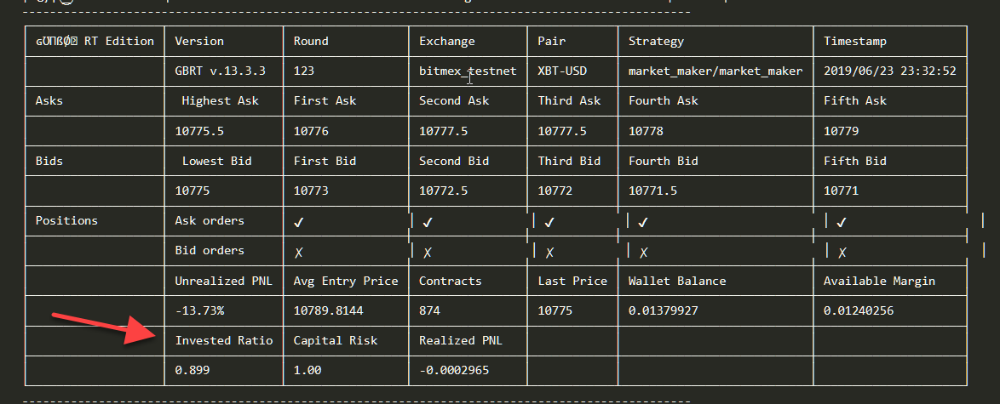

\_\_\_\_\_\_\_\_\_\_\_\_\_\_\_\_\_\_\_\_\_\_\_\_\_\_\_\_\_\_\_\_\_\_\_\_\_\_\_\_\_\_\_\_\_\_\_\_\_\_\_\_\_\_\_\_\_\_\_\_\_\_\_\_\_\_\_\_\_\_\_\_\_\_\_\_\_\_

To get to the top of the chat: SEARCH FOR, Humans are excited but yeah, I'm a bit wet

this will take you to top.

Getting Set up to run the MM Bot: Initial Steps.

But I dont see the "Market\_Maker" Strat to set buy and sell in the gui, what do I do?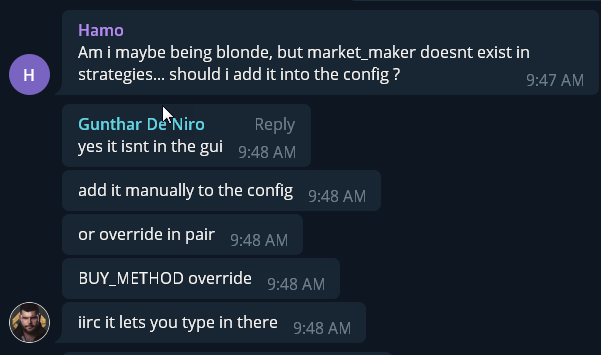

Orders in Yellow Highlight seen here on the order book are your current open order.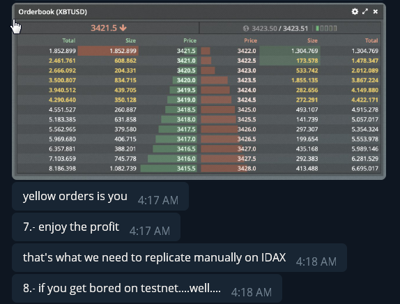

How Orders are placed and handled by the MM Bot!

Long or Short: How the Bot Makes Markets to -get _you_ PAID $$-

How does the Bot Handle already placed order on the books as price moves away from it?

Do we wait for a first Fill or does the bot Cancel the order?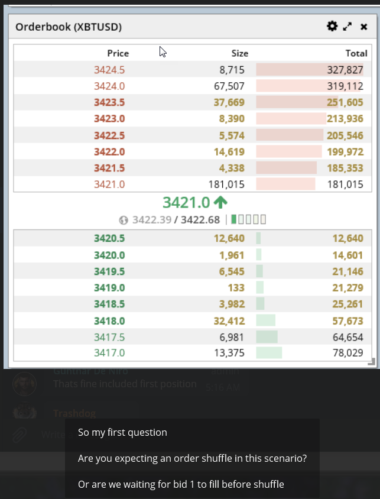

MM Bot places 5 order to both sides of the Book to start. the first one hit dictated long or short.

If you end up with 5 order and a 6th one gets placed do to moving prices?

Trashie lies to Gun, promises to behave, they know he is making up stories, "get Ceaser on the Job to control this wild dog!" lol

Trashie makes a compromise!

Make sure to - Turn Off: CANCEL\_ORDER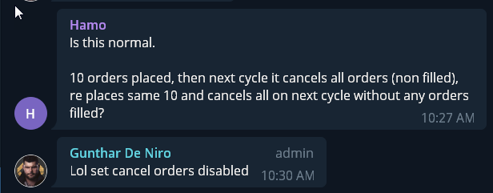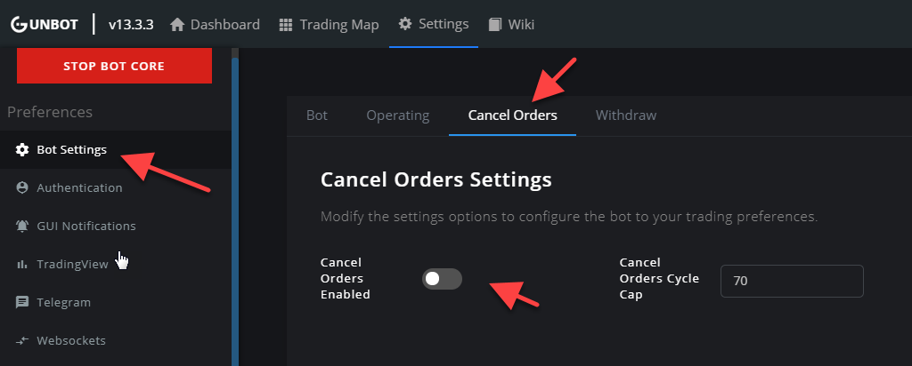

How To Set Your Trade Limit: We have BTC but BitMEX uses 1$ to 1Contract. So we set contract amounts in whole dollars. so 30 contracts = 30$ of your trade total stack of BTC. You must figure out how much your BTC is worth in a dollar conversion to help set your Contract amount. BitMEX also had minumums you must maintain when sending multiple orders. it changes as the price of BTC changes. But as a example right now BTC is 10k and you need at least 30 contracts for 5 up and 5 down to not get banned.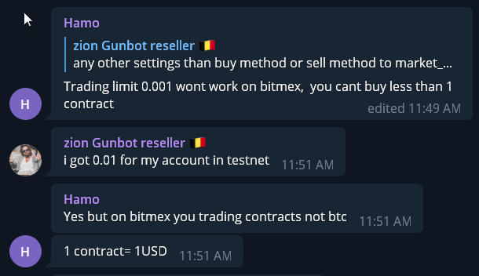

How to read your BitMEX Dashboard.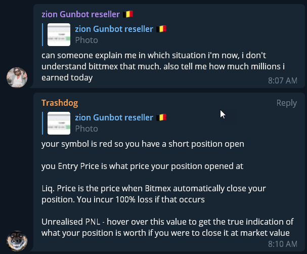

When you need to add more TestNet BTC to your Wallet you can get it here: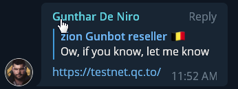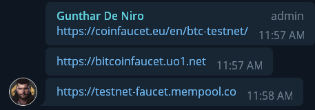

Api Request Limits: Moving your Exchange Delay to a higher number can help with avoiding soft bans as well as slow down the bot placing and changing order to fast. So with proper clarity on how to use Exchange Delay it can be use defensivly/offensivly and proactively for more than just avoiding bans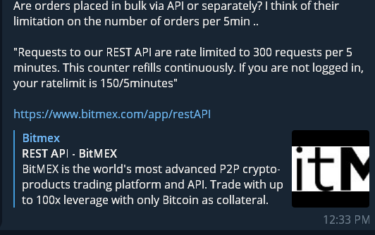

